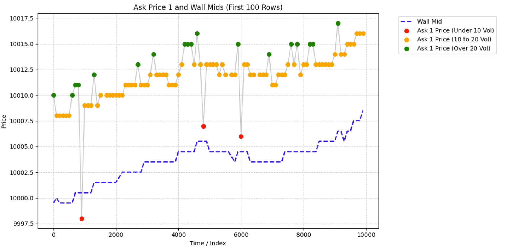
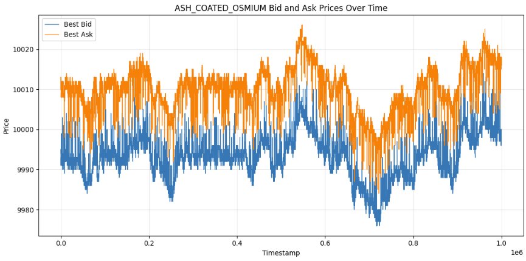
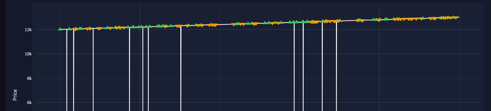
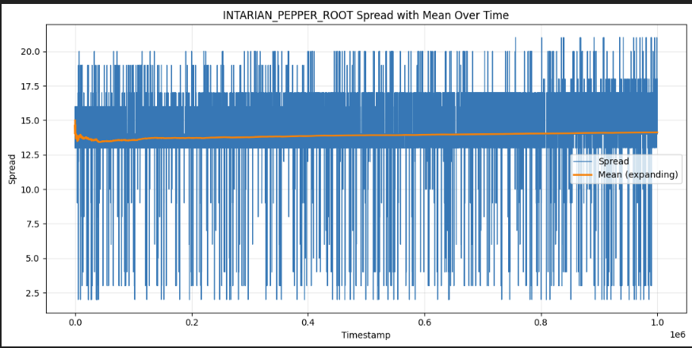
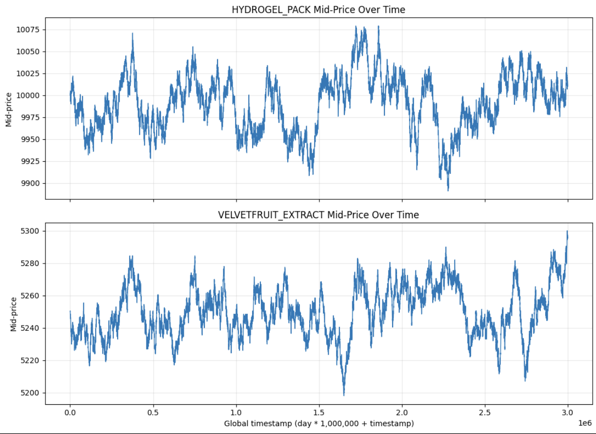
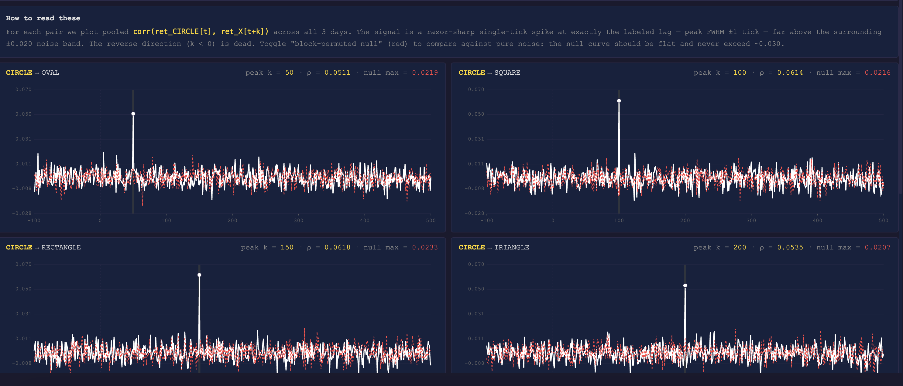

# IMC Prosperity 4 – Alpha Search Team

## About Us

Our approach combined quantitative research with execution-aware trading infrastructure, emphasizing robust signal discovery, market microstructure analysis, and inventory-aware optimization across multiple rounds of competition.

## Core Focus Areas
- Alpha signal research (microstructure, statistical, and cross-asset)
- Systematic strategy development
- Execution optimization and fill-probability modeling
- Risk and inventory management

## Results
- **4th place globally** out of 22,000+ teams in Round 4
- **23rd place** in the Round 3 algorithmic competition
- **27th place** in the Round 2 algorithmic competition

Through iterative research, simulation, and execution optimization, we developed scalable systematic trading strategies designed to perform under highly competitive market conditions.

## Overview

- [Algorithmic Challenge](#algorithmic-challenge)
  - [Round 1 and 2](#round-1-and-2)
  - [Round 3 and 4: Options Trading](#round-3-and-4-Options-Trading)
  - [Round 5: 50 assets tradable](#round-5-50-assets-tradable)

 - [Manual Challenge](#manual-challenge)
   - [Round 1: Walrasian Auction](#round-1-walrasian-auction)
   - [Round 2: Speed](#round-2-speed)
   - [Round 3: Choosing bids](#round-3-choosing-bids)
   - [Round 4: Options Portfolio Optimization](#round-4-options-portfolio-optimization)
   - [Round 5: News-based Portfolio](#round-5-news-based-portfolio)

## Algorithmic Challenge
Before the competition officially started, we prepared by building a backtester that satisfied our requirements. E.g.  we wanted some additional metrics to specify the risk of a trading strategy over another and how likely it is to be overfitted. We also built a dashboard to check if we can see some obvious patterns, like the informed trader "Olivia" in Prosperity 3, who always traded with volume 15. For the dashboard, we also added additional features, which we thought were useful.

### Round 1 and 2
#### ASH COATED OSMIUM
For Osmium, the strategy was completely different from that of Pepper root. We first started our search for an appropriate fair value estimate. For this, we took a similar approach at the Frankfurt Hedgehogs, defining a wall mid, but with volumes as a filter for it. We would forward fill this if a value is missing on either side. We found a pattern of volumes quoted in the market, which was symmetric for bids and asks.

*Figure: Osmium bots over time*

Given this and the fact that Osmium was mean reverting we formulated the following strategy. If the ask price is smaller than the wall mid, we take it, analogously for the bid side. Additionally, we do market making with two different modes, depending, if the current quotes in the market are made by market makers or not. We classify the quote into an MM quote if the distance of it to the wall mid is larger than 5. In this case, we post at the best bid + 1 or best ask -1. If the quote isn't by an MM, then we quote around the wall mid shifted by an inventory skew and a half spread of 4. 

*Figure: Osmium over time*

#### INTARIAN PEPPER ROOT
Pepper root had a clear pattern with an underlying upward trend and mean reversion around this trend. So the baseline approach for this asset was to just buy as aggressively as possible at the start and hold until the end. One major feature was also that the spread was increasing over time; thus, using an if statement, if the mid price is above the fair value and then selling and buying it back immediately, might not be the best approach. 

*Figure: Pepper root over time*

We structured the trading strategy for this asset into three phases: accumulation, mean reversion and position unwinding.
For the accumulation phase, we wanted to get to the position limit of 80 as fast as possible, but not pay too much for this. E.g. if the third best ask price would be 20 points away from the mid price, we could just wait one time step and, on average, get a better execution price at the best ask (as the rate of the trend isn't that extreme; it was around 0.1 per tick). To optimize this approach, we also took into consideration the current spread and a future time steps mid price. Additionally, we always posted bid orders to match bots who would sell. This kind of strategy we used throughout all rounds: we take all the LOs of the bots quoted, which satisfy a criterion we would want to trade, and if we predict the direction, we use the remaining size to trade to post LOs. To decide where to post those LOs, we analysed at which prices the bots are most likely to post their orders to match us and used an empirical estimate of it.
After we accumulated the maximum volume we are allowed to hold, we went into a mean reversion around the trend strategy phase. We first needed to figure out which fair value estimate we would like to use.
In terms of logic, it would be a bad approach to think that the fair value at time t should be the midprice/microprice or any other common fair value estimate, as the underlying trend would be neglected. So we decided to take a future mid price as our fair value (which we could just easily calculate by the slope times time) and trade the deviations of quoted prices from it. For this, we had two approaches: one using the deviations and one using the spread behaviour.
For the first approach, we had the following logic: If the currently quoted best bid is above a future time steps mid price, we would take it. If this isn't the case, but I could post an ask order such that it is still above this fair value, I would do it and keep track, if it got executed. The second approach is more of a statistical one. It abuses the distribution of the spread, given a specific time frame. For this, we record a certain amount of spread values (not the entire distribution, as the spreads mean increases in time) and if the current spread value is larger than a specific quantile, we post an ask order at the best ask - 1. If it gets executed, we just buy back at the next time steps quoted best ask. On average, this should be highly profitable, as we are trading the outliers of the spread distribution for a time period. 
Lastly, as the spread was increasing and the last time steps mid price is used to settle the position we are holding, we would lose money at the end of the trading period. To reduce this loss, we start posting orders below the best ask to capture any incoming order flow. We start with this process close to the end of the period. In the worst case, if no bot sends out a buy order, we get the same mid price settlement as without using this strategy. 

*Figure: Pepper root spread over time*

What we missed for both assets was that if one side isn't quoted, we could quote extremely wide and still get filled.
Also, we expected a massive regime change due to the simplicity of this task, so we had a generalisation of this strategy to any slope of the trend, also negative implemented. And the regime change prediction was correct, just in another way, as round 3 was completely different from the years before, and the two assets for the first two rounds weren't traded anymore and the PnL was reset to 0.

### Round 3 and 4: Options Trading
For rounds 3 and 4, the assets of previous rounds weren't available to trade anymore. We first looked into potential relationships between Hydrogel and Velvetfruit, but didn't find any besides them both being mean reverting.

#### HYDROGEL PACK and VELVETFRUIT EXTRACT (VFE)
We tried several market making algorithms and different mean reversion approaches, but the market making approach didn't work, as there were too few incoming trades to get rid of the inventory before the market moved away. For the mean reversion part, we tested z-score-based approaches as well as VWAP, but the final solution, which performed best OOS a simple mean over time and taking the deviations from it. To optimize this approach, we used a prior based on the data from the previous days' data to start trading as soon as possible. Additionally, we used posted limit orders to maximize the directional position size. We just posted the remaining position size after taking the orders quoted by bots, thus, in the worst case, getting no execution, in the best case, getting an execution in the direction we already wanted to trade at a better price. 

*Figure: Hydrogel and VFE over time*

#### Options on VFE
There were ten vanilla call options on VFE with strikes 4000, 4500, 5000, 5100, 5200, 5300, 5400, 5500, 6000, 6500.
For the options pricing, it was clear from the Wiki that we should use standard Black-Scholes pricing. The first thing we did was to get a volatility surface and see if there were any anomalies for the Greeks. After that, we checked for any convexity (butterfly spread arbitrage) violations, where there weren't any in the data. The next step was to check if there is any lead-lag relationship to find, given the current option prices and the approximate changes they should follow to the next time step. Again, nothing to be found here. As the underlying VFE was mean reverting, we couldn't trust any of the mean reverting options combinations. Through time, the volatility surface wasn't stable, so we couldn't trade that either. As the price of the underlying VFE was around 5200-5300, 6000 and 6500 strikes were far OTM and traded between 0 and 1. For round 3, we didn't trade those at all and only included them in round 4 after seeing which bots took what kind of trades. For the other options, they all followed the underlying's direction perfectly;  thus, just trading the underlying and doing the same trades with each of the options seemed to be the best option (or choice, if you don't like the word play).

#### Informed/Uninformed Traders

For round 4, we were given the data set with added bot names for each trade. We extended this data set by also getting who is quoting at which price for every time step, and at which prices bots are most likely to take it (only for the website data, thus we had too few data points for the trades analysis).
We tried to analyze which bots make positive EV predictions over several different time frames. We split that into two parts, one observing the quoted side, and classifying if they are informed or not and for the aggressive sides trades. Only Mark 67 seemed to have a clear edge here, but the edge was too insignificant to outperform our round 3 algorithm due to high transaction costs. Some of the bots were also trading only at a specific price (one was always selling at the price of 7). We also tried to classify into informed/uninformed based on the volumes of the Mark's. 
We posted bids at 0 and asks at 1 for the 6000 and 6500 strikes, after seeing that Mark 22 sells them at 0. 

### Round 5: 50 assets trabable
In round 5, due to the enormous amount of tradable assets, we needed to rethink our approach. We first tried to find pairs which would cointegrate and classify the assets into common behaviour. For the former, we found that almost all cointegrations don't hold OOS.

#### Purification Pebbles: XS - XL
For Pebbles, there was a strict relationship that all components added had the value 50k. We used this to improve the fair value for XL to do market making around 50k - midprice of the components. For XS and S, there was a relationship similar to Pepper root, but now downwards trending: XS+S = 20k - slope times time. We used the same strategy as for Pepper root here, just with the combination of XS and S. For M and L, we used a mean reversion approach.

#### Organic Microchips
For Microchips, we found a lead-lag relationship between Circle and the other assets, with Circle leading (see the figure below). Knowing such a relationship exists, we only traded the 4 other assets of microchips, excluding Circle. The strategy was simply that if Circle made a large enough directional movement over a specified period, we would trade it in all of the other assets with respect to the lag. For risk management, as it wasn't a perfect correlation, we would exit if the price change didn't behave as expected. Also, we would continue to stay in this position as long as Circle is moving in this direction, if our prediction is correct.

*Figure: Lead-lag relationship of microchips*

#### UV-Visors
UV had one of the cointegrations, which holds strongly. It had the weights and assets: 3 magenta, 2 amber and 1 red, with a constant mean of 60k. We traded the deviations from this mean with the appropriate weights and scaled them up to the position limit of 10. As enough trades were occurring with this strategy, we used stochastic rounding to maximize the PnL of it. 

#### Market Making
For every volume, which wasn't used by another strategy, we used market making, if the asset allowed for it. This only uses up to size 2 per asset (tested the optimal ratio). For the market making algorithm itself, we needed to select an approach which has minimal parameters across all of the traded assets. For this, we had a percentage-based approach to make assets comparable and decide on their spread given some simple heuristics, which we can tune. Additionally, due to the fact that some had smaller spreads, we needed some logic for the edge cases, e.g. if the quoted spread is 3 or smaller.

 ## Manual Challenge

 ### Round 1: Walrasian Auction
 There were two auctions, which you can participate in, both with price-time priority, where you were the last person to submit an order before the clearing price was decided to maximize traded volume. The solution was straightforward, if you know how the Walrasian auction works (it wasn't mentioned in the challenge, of course). We knew that after the clearing price is decided, we would be able to settle the position at a specified price, 30 for the first auction and 20 for the second auction. There were two approaches we followed: just looking at the orders of the others in the market and brute-forcing the answer. We did both to double-check our result, and they agreed. To brute-force it, you just need to calculate the clearing price, given the intended trade you will do (with both specified price and volume, over which you loop) and just calculate the PnL of it. Then you take the maximum of those outputs as your intended trade.

### Round 2: Speed

### Round 3: Choosing bids

### Round 4: Options Portfolio Optimization

### Round 5: News-based Portfolio

## Code availability

The full codebase includes:

- Systematic signal research
- Strategy logic (pricing, risk, signal integration)
- Execution and queue-priority handling

> **If you are a recruiter from a quantitative trading firm**, feel free to email me for access to the full implementation and additional technical details.
